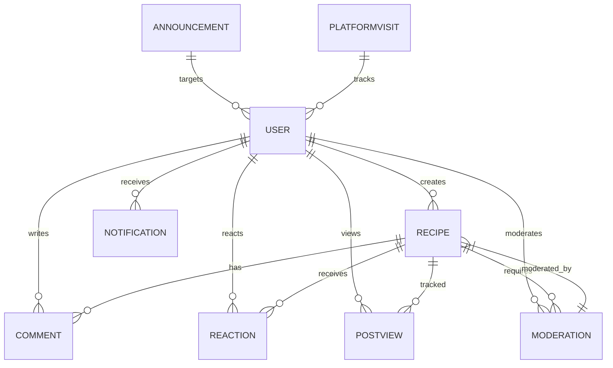
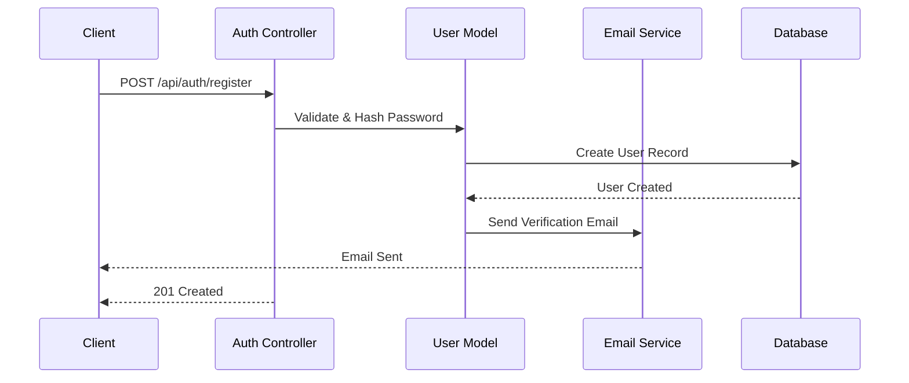
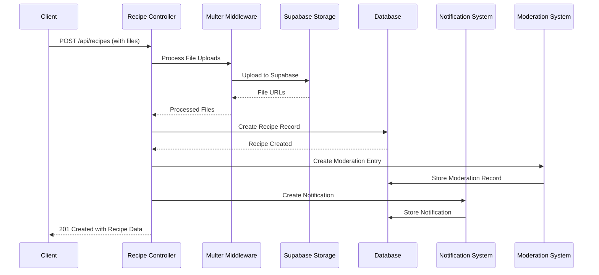
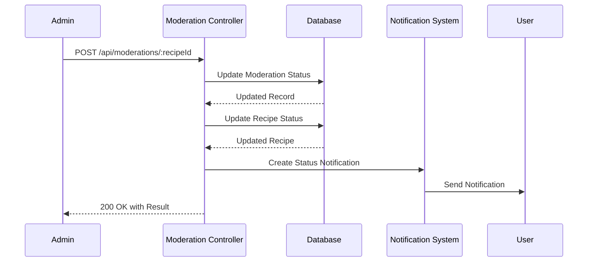
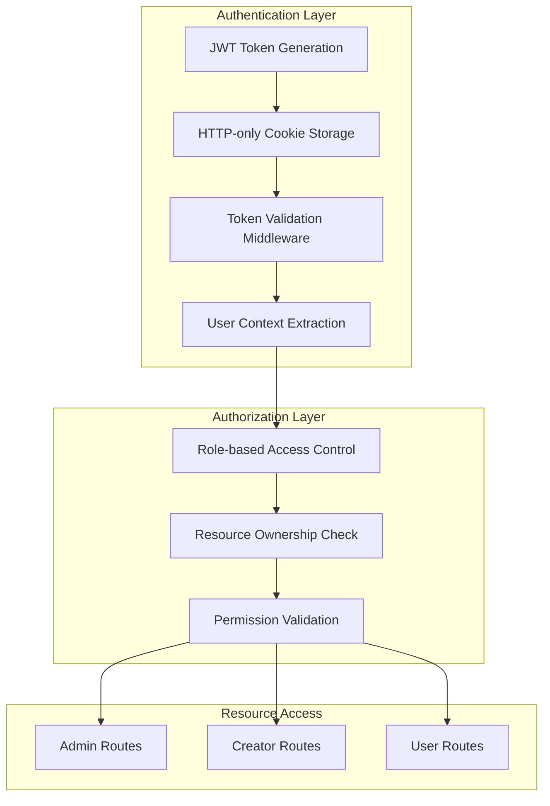

# Kulinarya Backend Architecture Documentation

## 🏗️ System Architecture Overview

### High-Level Architecture
```
┌─────────────────┐     ┌─────────────────┐     ┌─────────────────┐
│   Client App    │────▶│   API Gateway   │────▶│   Express.js    │
│   (Frontend)    │     │   (Reverse      │     │   Backend       │
│                 │◀────│    Proxy)       │◀────│                 │
└─────────────────┘     └─────────────────┘     └─────────────────┘
                                                         │
                                                         ▼
┌─────────────────┐     ┌─────────────────┐     ┌─────────────────┐
│   Supabase      │◀────│   File Upload   │◀────│   Multer        │
│   Storage       │     │   Service       │     │   Middleware    │
└─────────────────┘     └─────────────────┘     └─────────────────┘
                                                         │
                                                         ▼
┌─────────────────┐     ┌─────────────────┐     ┌─────────────────┐
│   MongoDB       │◀────│   Mongoose      │◀────│   Data Models   │
│   Database      │     │   ODM           │     │   & Schemas     │
└─────────────────┘     └─────────────────┘     └─────────────────┘
                                                         │
                                                         ▼
┌─────────────────┐     ┌─────────────────┐     ┌─────────────────┐
│   Email Service │◀────│   Nodemailer    │◀────│   Email Utils   │
│   (Resend)      │     │   Integration   │     │                 │
└─────────────────┘     └─────────────────┘     └─────────────────┘
```

## 📁 Project Structure Deep Dive

### Directory Structure
```
server/
├── src/
│   ├── app.js                    # Express app configuration
│   ├── config/
│   │   └── database.js          # MongoDB connection setup
│   ├── controllers/              # Business logic handlers
│   │   ├── authController.js     # Authentication operations
│   │   ├── recipeController.js   # Recipe CRUD operations
│   │   ├── userController.js     # User management
│   │   ├── commentController.js  # Comment operations
│   │   ├── reactionController.js # Reaction operations
│   │   ├── moderationController.js # Moderation workflow
│   │   ├── notificationController.js # Notification system
│   │   ├── announcementController.js # Announcement management
│   │   ├── platformVisitController.js # Analytics tracking
│   │   └── postViewController.js # Post view tracking
│   ├── middleware/               # Custom middleware
│   │   ├── authenticateUser.js   # JWT authentication
│   │   ├── checkRole.js          # Role-based authorization
│   │   ├── errorHandler.js       # Global error handling
│   │   ├── initialLogin.js       # Initial admin setup
│   │   ├── multerMiddleware.js   # File upload handling
│   │   └── resendLimiter.js      # Rate limiting for resends
│   ├── models/                   # MongoDB schemas
│   │   ├── userModel.js          # User schema with auth methods
│   │   ├── recipeModel.js        # Recipe schema with business logic
│   │   ├── moderationModel.js    # Moderation workflow schema
│   │   ├── reactionModel.js      # Reaction schema
│   │   ├── commentModel.js       # Comment schema
│   │   ├── postViewModel.js      # Post view tracking schema
│   │   ├── notificationModel.js  # Notification schema
│   │   ├── announcementModel.js  # Announcement schema
│   │   ├── platformVisitModel.js # Platform visit tracking
│   │   ├── resendAttemptModel.js # Rate limiting for email resends
│   │   └── resetTokenModel.js    # Password reset tokens
│   ├── routes/                   # API route definitions
│   │   ├── authRoutes.js         # Authentication routes
│   │   ├── userRoutes.js         # User management routes
│   │   ├── recipeRoutes.js       # Recipe CRUD routes
│   │   ├── commentRoutes.js      # Comment routes
│   │   ├── reactionRoutes.js     # Reaction routes
│   │   ├── moderationRoutes.js   # Moderation routes
│   │   ├── notificationRoutes.js # Notification routes
│   │   ├── announcementRoutes.js # Announcement routes
│   │   ├── platformVisitRoutes.js # Analytics routes
│   │   └── postViewRoutes.js     # Post view routes
│   ├── utils/                    # Utility functions
│   │   ├── aggregationPipelines.js # MongoDB aggregation queries
│   │   ├── customError.js        # Custom error class
│   │   ├── deleteSupabaseFile.js # File deletion utility
│   │   ├── emailTransporter.js   # Email sending setup
│   │   ├── environmentConditions.js # Environment config
│   │   ├── handleSupabaseUpload.js # File upload utility
│   │   ├── notificationUtils.js  # Notification helpers
│   │   ├── recipeUtils.js        # Recipe-specific utilities
│   │   ├── resendAttemptUtils.js # Resend attempt tracking
│   │   ├── supabase.js           # Supabase client setup
│   │   ├── tokenUtils.js         # JWT token utilities
│   │   └── validators.js         # Validation helpers
│   ├── validations/              # Zod validation schemas
│   │   ├── userValidations.js    # User data validation
│   │   ├── recipeValidations.js  # Recipe data validation
│   │   ├── commentValidation.js  # Comment validation
│   │   ├── reactionValidation.js # Reaction validation
│   │   ├── moderationValidations.js # Moderation validation
│   │   ├── notificationValidation.js # Notification validation
│   │   ├── announcementValidation.js # Announcement validation
│   │   ├── platformVisitValidation.js # Platform visit validation
│   │   └── postViewValidation.js # Post view validation
│   └── mail/                     # Email templates
│       ├── sendPasswordResetEmail.js # Password reset email
│       └── sendVerificationEmail.js  # Verification email
├── kulinarya-api/                # Bruno API collection
├── server.js                     # Application entry point
└── package.json                  # Dependencies and scripts
```

## 🗄️ Database Schema Design

### User Model
```javascript
{
  email: String,           // Unique, required
  password: String,        // Hashed, required
  isEmailVerified: Boolean, // Default: false
  role: String,            // Enum: ['admin', 'creator', 'user']
  firstName: String,       // Required
  middleName: String,      // Optional
  lastName: String,        // Required
  profilePictureUrl: String, // Optional
  bio: String,            // Optional
  deletedAt: Date,         // Soft delete timestamp
  createdAt: Date,         // Auto-generated
  updatedAt: Date          // Auto-generated
}
```

### Recipe Model
```javascript
{
  byUser: ObjectId,        // Reference to User
  title: String,           // Required
  foodCategory: String,    // Enum: ['dishes', 'soup', 'drinks', 'desserts', 'pastries']
  originProvince: String,  // Required
  mainPictureUrl: String,  // Optional
  additionalPicturesUrls: [String], // Array of URLs
  videoUrl: String,        // Optional
  description: String,     // Optional
  ingredients: [{          // Array of ingredient objects
    quantity: Number,
    unit: String,
    name: String,          // Required
    notes: String
  }],
  procedure: [{            // Array of step objects
    stepNumber: Number,    // Required
    content: String        // Required
  }],
  moderationInfo: ObjectId, // Reference to Moderation
  status: String,          // Enum: ['pending', 'approved', 'rejected']
  isFeatured: Boolean,     // Default: false
  deletedAt: Date,         // Soft delete timestamp
  createdAt: Date,
  updatedAt: Date
}
```

### Moderation Model
```javascript
{
  forPost: ObjectId,       // Reference to Recipe
  moderatedBy: ObjectId,   // Reference to User (admin)
  status: String,          // Enum: ['pending', 'approved', 'rejected']
  notes: String,           // Optional moderation notes
  createdAt: Date,
  updatedAt: Date
}
```

### Relationships


## 🔄 Data Flow Diagrams

### User Registration Flow


### Recipe Creation Flow


### Recipe Moderation Flow


## 🛡️ Security Architecture

### Authentication & Authorization


### Security Measures Table
| Layer | Security Measure | Implementation |
|-------|-----------------|----------------|
| **Authentication** | JWT with HTTP-only cookies | `authenticateUser` middleware |
| **Authorization** | Role-based access control | `checkRole` middleware |
| **Input Validation** | Zod schema validation | Validation schemas in `/validations/` |
| **File Upload** | Type & size validation | Multer middleware with validation |
| **Password Security** | bcrypt hashing | User model pre-save hooks |
| **Rate Limiting** | Resend attempt tracking | `resendAttemptModel` & middleware |
| **Error Handling** | Custom error classes | `customError.js` utility |
| **CORS** | Origin restriction | Express CORS middleware |

## 🔧 Key Design Patterns

### 1. Repository Pattern
- Models contain business logic and data access methods
- Controllers handle HTTP layer only
- Separation of concerns between data access and HTTP handling

### 2. Middleware Chain
- Request validation → Authentication → Authorization → Business logic
- Error handling at each layer
- Consistent response formatting

### 3. Soft Delete Pattern
- `deletedAt` timestamp instead of physical deletion
- All queries filter out soft-deleted records
- Recovery capability for accidental deletions

### 4. Event-Driven Notifications
- System events trigger notifications
- Async notification creation
- User preference-based delivery

### 5. Aggregation Pipeline Pattern
- Complex queries use MongoDB aggregation
- Performance optimization for analytics
- Reusable pipeline components

## 📊 Performance Considerations

### Database Indexing Strategy
```javascript
// User Model Indexes
UserSchema.index({ email: 1 }, { unique: true });
UserSchema.index({ role: 1 });
UserSchema.index({ deletedAt: 1 });

// Recipe Model Indexes
RecipeSchema.index({ byUser: 1 });
RecipeSchema.index({ status: 1 });
RecipeSchema.index({ isFeatured: 1 });
RecipeSchema.index({ deletedAt: 1 });
RecipeSchema.index({ createdAt: -1 });

// Moderation Model Indexes
ModerationSchema.index({ forPost: 1 });
ModerationSchema.index({ status: 1 });
ModerationSchema.index({ moderatedBy: 1 });

// Composite Indexes for Common Queries
RecipeSchema.index({ status: 1, isFeatured: 1 });
RecipeSchema.index({ byUser: 1, deletedAt: 1 });
```

### Caching Strategy
| Data Type | Cache Strategy | TTL | Implementation |
|-----------|---------------|-----|----------------|
| **User Profile** | Session-based | 1 hour | JWT token claims |
| **Recipe Lists** | Pagination cache | 5 minutes | Redis/Memory cache |
| **Top Sharers** | Daily cache | 24 hours | Scheduled job |
| **Featured Recipes** | Weekly cache | 7 days | Manual refresh |

### File Upload Optimization
- Chunked uploads for large files
- Compression for images
- CDN integration for static assets
- Async file processing queue

## 🚀 Deployment Architecture

### Production Environment
```
┌─────────────────────────────────────────────────────┐
│                    Load Balancer                     │
└──────────────┬──────────────────┬───────────────────┘
               │                  │
    ┌──────────▼──────┐  ┌───────▼──────────┐
    │   Node.js App   │  │   Node.js App    │
    │   Instance 1    │  │   Instance 2     │
    └──────────┬──────┘  └───────┬──────────┘
               │                  │
    ┌──────────▼──────────────────▼──────────┐
    │           MongoDB Cluster              │
    │         (Primary + Replicas)           │
    └──────────┬──────────────────┬──────────┘
               │                  │
    ┌──────────▼──────┐  ┌───────▼──────────┐
    │   Supabase      │  │   Redis Cache    │
    │   Storage       │  │                  │
    └─────────────────┘  └──────────────────┘
```

### Environment Configuration
```javascript
// Environment-based configuration
const config = {
  development: {
    mongoURI: process.env.MONGO_URI_DEV,
    clientURL: process.env.CLIENT_URL_DEV,
    cookieSettings: { secure: false, sameSite: 'lax' }
  },
  production: {
    mongoURI: process.env.MONGO_URI_PROD,
    clientURL: process.env.CLIENT_URL_PROD,
    cookieSettings: { secure: true, sameSite: 'none' }
  }
};
```

## 📈 Monitoring & Logging

### Logging Strategy
- **Morgan** for HTTP request logging
- **Console logging** for development
- **Structured logging** for production
- **Error tracking** with stack traces

### Health Checks
- Database connection status
- External service availability
- Memory usage monitoring
- Response time tracking

### Metrics Collection
- API response times
- Error rates by endpoint
- User activity patterns
- File upload success rates

## 🔄 API Versioning Strategy

### Current: v1 (Implicit)
- All endpoints under `/api/`
- Backward compatibility maintained
- Breaking changes documented

### Future: v2 (Explicit)
- `/api/v2/` prefix for new endpoints
- Gradual migration path
- Deprecation notices for v1

## 🛠️ Development Workflow

### Code Standards
- ES6+ JavaScript with modules
- Async/await pattern for async operations
- Consistent error handling
- Comprehensive JSDoc comments

### Testing Strategy
- Unit tests for utility functions
- Integration tests for API endpoints
- E2E tests for critical user flows
- Load testing for performance validation

### CI/CD Pipeline
```
Code Commit → Lint Check → Unit Tests → Integration Tests → Build → Deploy
```

## 🔍 Troubleshooting Guide

### Common Issues & Solutions

| Issue | Symptoms | Solution |
|-------|----------|----------|
| **Database Connection** | 500 errors, connection refused | Check MongoDB URI, network connectivity |
| **File Upload Failures** | 413 errors, upload timeouts | Verify file size limits, Supabase config |
| **Authentication Issues** | 401 unauthorized errors | Check JWT secret, cookie settings |
| **Email Delivery** | Verification emails not sent | Verify SMTP configuration, check spam |
| **Performance Issues** | Slow response times | Check database indexes, query optimization |

### Debugging Tools
- Detailed error logging
- Request/Response logging
- Database query logging
- Memory usage monitoring

## 📚 Additional Resources

### API Documentation
- Complete Bruno API collection in `/kulinarya-api/`
- Postman collection export available
- OpenAPI/Swagger documentation (planned)

### Development Setup
- Detailed setup instructions in README
- Environment variable templates
- Database seeding scripts

### Deployment Guides
- Docker containerization
- Kubernetes deployment manifests
- Cloud provider specific guides

---

*This architecture documentation provides a comprehensive overview of the Kulinarya backend system. For specific implementation details, refer to the source code and inline documentation.*