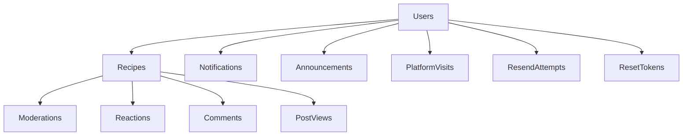

# Kulinarya Backend Documentation Summary

## 📚 Documentation Overview

This repository now contains comprehensive documentation for the Kulinarya Recipe Sharing Platform backend. The documentation is organized into several focused documents:

### 📋 **README.md** - Project Overview
- **Purpose**: High-level introduction and quick start guide
- **Contents**:
  - Project description and features
  - Tech stack and architecture overview
  - Quick installation instructions
  - API endpoint summary
  - Basic configuration guide

### 🏗️ **ARCHITECTURE.md** - System Architecture
- **Purpose**: Detailed technical architecture and design patterns
- **Contents**:
  - System architecture diagrams
  - Database schema design
  - Data flow diagrams
  - Security architecture
  - Performance considerations
  - Deployment architecture
  - Design patterns used

### 🔗 **API_DOCUMENTATION.md** - API Reference
- **Purpose**: Complete API endpoint documentation
- **Contents**:
  - All endpoint specifications with examples
  - Request/response formats
  - Authentication details
  - Error codes and handling
  - File upload specifications
  - Role-based access control
  - Pagination and search parameters

### 🚀 **DEPLOYMENT.md** - Deployment Guide
- **Purpose**: Step-by-step deployment instructions
- **Contents**:
  - Local development setup
  - Docker deployment
  - Cloud deployment (AWS EC2)
  - Database setup (MongoDB Atlas)
  - File storage setup (Supabase)
  - Email service setup (Resend)
  - Security configuration
  - Monitoring and maintenance
  - Troubleshooting guide

### 🛠️ **DEVELOPER_GUIDE.md** - Developer Handbook
- **Purpose**: Guide for developers working on the codebase
- **Contents**:
  - Project structure explanation
  - Code style guidelines
  - Adding new features workflow
  - Testing strategies
  - Debugging techniques
  - Performance optimization
  - Database migrations
  - Contribution guidelines
  - Security best practices

## 🎯 Key Features Documented

### Core System Components
1. **User Management System**
   - Registration with email verification
   - Authentication with JWT tokens
   - Role-based access control (Admin, Creator, User)
   - Profile management with file uploads

2. **Recipe Management**
   - Complete CRUD operations for recipes
   - Media uploads (images and videos)
   - Categorization and search
   - Moderation workflow
   - Featured recipes system

3. **Engagement Features**
   - Reactions (heart, drool, neutral)
   - Comments system with pagination
   - Post view tracking
   - User notifications

4. **Admin Features**
   - Recipe moderation and approval
   - User management
   - Announcement system
   - Platform analytics

5. **Infrastructure**
   - File storage with Supabase
   - Email service integration
   - Rate limiting and security
   - Comprehensive error handling

## 📊 Database Schema Summary

### Main Collections

### Key Relationships
- **Users** → **Recipes** (One-to-Many)
- **Recipes** → **Moderations** (One-to-One)
- **Recipes** → **Reactions/Comments/Views** (One-to-Many)
- **Users** → **Notifications** (One-to-Many)

## 🔐 Security Implementation

### Authentication & Authorization
- JWT tokens stored in HTTP-only cookies
- Password hashing with bcrypt
- Email verification system
- Password reset functionality
- Role-based access control

### Input Validation & Sanitization
- Zod schema validation for all inputs
- File type and size validation
- XSS protection
- SQL injection prevention (Mongoose)

### Rate Limiting
- Email resend attempts tracking
- Password reset attempts limiting
- API request rate limiting

## 🚀 Deployment Options

### 1. **Local Development**
- Quick setup with npm
- MongoDB local instance
- Development environment configuration

### 2. **Docker Deployment**
- Containerized application
- MongoDB in separate container
- Easy scaling and management

### 3. **Cloud Deployment (AWS)**
- EC2 instance setup
- MongoDB Atlas integration
- Supabase for file storage
- Resend for email services

## 🧪 Testing Strategy

### Manual Testing
- Bruno API collection included
- Comprehensive test scenarios
- Environment-specific testing

### Automated Testing (Planned)
- Unit tests for models and utilities
- Integration tests for API endpoints
- E2E tests for critical user flows

## 📈 Performance Considerations

### Database Optimization
- Strategic indexing on frequently queried fields
- Aggregation pipelines for complex queries
- Connection pooling configuration

### Caching Strategy
- Session-based caching for user data
- Recipe listing pagination cache
- Daily cache for top sharers
- Weekly cache for featured recipes

### File Upload Optimization
- Chunked uploads for large files
- Image compression
- CDN integration for static assets

## 🔄 Development Workflow

### Branch Strategy
- `main`: Production-ready code
- `develop`: Integration branch
- `feature/*`: New features
- `bugfix/*`: Bug fixes
- `hotfix/*`: Critical production fixes

### Code Review Process
1. Create feature branch
2. Implement changes with tests
3. Update documentation
4. Submit pull request
5. Code review by team
6. Merge to develop branch
7. Deploy to staging
8. Production deployment

## 🆘 Support and Troubleshooting

### Common Issues
- Database connection problems
- File upload failures
- Email delivery issues
- Authentication errors

### Debugging Tools
- Detailed logging in development
- MongoDB query logging
- Request/response logging
- Error tracking with stack traces

### Monitoring
- Application health checks
- Performance metrics
- Error rate monitoring
- User activity tracking

## 📝 Documentation Maintenance

### Keeping Documentation Updated
1. **When adding new features**: Update all relevant documentation
2. **When changing APIs**: Update API documentation
3. **When modifying architecture**: Update architecture documentation
4. **When deploying changes**: Update deployment guide
5. **Regular reviews**: Quarterly documentation review

### Documentation Standards
- Use clear, concise language
- Include code examples
- Add diagrams for complex concepts
- Keep examples up-to-date
- Cross-reference between documents

## 🎉 Next Steps

### Immediate Actions
1. Review and test the documentation
2. Update environment-specific configurations
3. Set up monitoring and alerting
4. Implement automated testing

### Future Enhancements
1. Add OpenAPI/Swagger documentation
2. Implement comprehensive test suite
3. Add performance monitoring dashboard
4. Create developer onboarding checklist
5. Add API versioning strategy

## 📞 Contact and Support

For questions or issues:
- **GitHub Issues**: Bug reports and feature requests
- **Documentation**: Refer to these guides
- **Development Team**: Internal communication channels
- **Production Support**: Dedicated support rotation

---

*This documentation provides a comprehensive overview of the Kulinarya backend system. All documents should be kept up-to-date as the system evolves. For the latest information, always refer to the source code and actual implementation.*