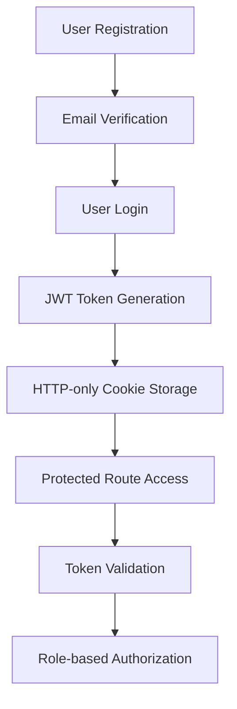

# Kulinarya - Recipe Sharing Platform Backend

A comprehensive backend API for a Filipino recipe sharing platform with user authentication, recipe management, moderation system, and engagement features.

## 📋 Overview

Kulinarya is a full-stack recipe sharing platform that allows users to discover, share, and engage with Filipino recipes. The backend is built with Node.js, Express, MongoDB, and Supabase for file storage.

## 🏗️ Architecture

### Tech Stack
- **Runtime**: Node.js with ES Modules
- **Framework**: Express.js
- **Database**: MongoDB with Mongoose ODM
- **File Storage**: Supabase Storage
- **Authentication**: JWT with HTTP-only cookies
- **Validation**: Zod schema validation
- **Email**: Nodemailer with Resend
- **Rate Limiting**: Express Rate Limit
- **Logging**: Morgan

### Project Structure
```
server/
├── src/
│   ├── app.js                 # Main Express application
│   ├── config/               # Database configuration
│   ├── controllers/          # Route controllers
│   ├── middleware/           # Custom middleware
│   ├── models/              # MongoDB schemas
│   ├── routes/              # API route definitions
│   ├── utils/               # Utility functions
│   ├── validations/         # Zod validation schemas
│   └── mail/                # Email templates and sending
├── kulinarya-api/           # Bruno API collection
├── server.js               # Application entry point
└── package.json
```

## 🚀 Features

### Core Features
- **User Management**: Registration, authentication, profile management
- **Recipe System**: Create, read, update, delete recipes with media uploads
- **Moderation Workflow**: Admin approval system for recipes
- **Engagement Features**: Reactions, comments, post views tracking
- **Notifications**: Real-time notifications for user actions
- **Analytics**: Platform visits tracking, top sharers, engagement metrics
- **Admin Features**: User management, announcement system, recipe featuring

### Security Features
- JWT-based authentication with HTTP-only cookies
- Password hashing with bcrypt
- Email verification system
- Rate limiting for sensitive endpoints
- Role-based access control (Admin, Creator, User)
- Input validation with Zod schemas
- File type and size validation

## 📊 Database Schema

### Key Models
- **User**: User accounts with roles (admin, creator, user)
- **Recipe**: Recipe posts with ingredients, procedure, media
- **Moderation**: Recipe approval workflow tracking
- **Reaction**: User reactions to recipes (heart, drool, neutral)
- **Comment**: User comments on recipes
- **PostView**: Recipe view tracking
- **Notification**: User notification system
- **Announcement**: System announcements
- **PlatformVisit**: Platform analytics tracking

## 🔌 API Endpoints

### Authentication (`/api/auth`)
- `POST /register` - User registration
- `POST /login` - User login
- `POST /logout` - User logout
- `GET /verify-email` - Email verification
- `POST /resend-verification` - Resend verification email
- `POST /forgot-password` - Password reset request
- `POST /reset-password` - Password reset
- `GET /user-details` - Get authenticated user details

### Users (`/api/users`)
- `GET /` - Get all users (admin only)
- `GET /:userId` - Get specific user data
- `PUT /:userId` - Update user profile
- `DELETE /:userId` - Soft delete user account
- `GET /:userId/recipes` - Get user's recipes
- `POST /:userId/change-password` - Change password
- `GET /top-sharers` - Get top recipe sharers

### Recipes (`/api/recipes`)
- `POST /` - Create new recipe
- `GET /` - Get approved recipes with pagination
- `GET /pending` - Get pending recipes (admin only)
- `GET /featured` - Get featured recipes
- `GET /top-engaged` - Get top engaged recipes
- `GET /:recipeId` - Get specific recipe
- `PUT /:recipeId` - Update recipe
- `DELETE /:recipeId` - Soft delete recipe
- `PATCH /:recipeId/feature` - Toggle recipe feature (admin only)

### Reactions (`/api/reactions`)
- `POST /` - Add reaction to recipe
- `GET /top-reacted` - Get top reacted recipes
- `GET /:recipeId` - Get reactions for specific recipe

### Comments (`/api/comments`)
- `POST /` - Add comment to recipe
- `GET /:recipeId` - Get comments for recipe
- `PUT /:commentId` - Update comment
- `DELETE /:commentId` - Soft delete comment

### Moderation (`/api/moderations`)
- `GET /pending` - Get pending moderations (admin only)
- `POST /:recipeId` - Moderate recipe (approve/reject)

### Notifications (`/api/notifications`)
- `GET /` - Get user notifications
- `PATCH /read-all` - Mark all notifications as read
- `PATCH /:notificationId/read` - Mark specific notification as read
- `DELETE /:notificationId` - Soft delete notification

### Announcements (`/api/announcements`)
- `GET /` - Get all announcements (admin only)
- `GET /active` - Get active announcements
- `POST /` - Create announcement (admin only)
- `PUT /:announcementId` - Update announcement (admin only)
- `DELETE /:announcementId` - Soft delete announcement (admin only)

## 🔐 Authentication Flow



## 📁 File Upload System

### Supported Media Types
- **Images**: JPEG, PNG, WebP (max 2MB)
- **Videos**: MP4, MOV (max 50MB)

### Storage Structure
```
supabase-storage/
├── profile_pictures/
├── recipe_pictures/
└── recipe_videos/
```

### Upload Flow
1. File validation (type, size)
2. Unique filename generation
3. Supabase upload
4. URL storage in database
5. Old file cleanup on updates

## 🛡️ Security Measures

### Authentication & Authorization
- JWT tokens stored in HTTP-only cookies
- Role-based access control (RBAC)
- Token expiration and validation
- Password hashing with bcrypt

### Input Validation
- Zod schema validation for all inputs
- Object ID validation
- File type and size validation
- XSS protection through input sanitization

### Rate Limiting
- Email resend attempts tracking
- Password reset attempts limiting
- API request rate limiting

## 🚦 Environment Variables

```env
# Server Configuration
PORT=4000
NODE_ENV=development

# Database
MONGO_URI_DEV=mongodb://localhost:27017/kulinarya
MONGO_URI_PROD=your_production_mongo_uri

# JWT
JWT_SECRET=your_jwt_secret_key

# Client URLs
CLIENT_URL_DEV=http://localhost:3000
CLIENT_URL_PROD=your_production_client_url

# Email Configuration
EMAIL_HOST=smtp.resend.com
EMAIL_PORT=465
EMAIL_USER=your_email_user
EMAIL_PASSWORD=your_email_password
EMAIL_FROM=noreply@kulinarya.com

# Supabase Configuration
SUPABASE_URL=your_supabase_url
SUPABASE_ANON_KEY=your_supabase_anon_key
SUPABASE_BUCKET_NAME=your_bucket_name

# Initial Admin
INITIAL_ADMIN_EMAIL=admin@kulinarya.com
INITIAL_ADMIN_PASSWORD=admin_password
```

## 🚀 Getting Started

### Prerequisites
- Node.js 18+
- MongoDB 6+
- Supabase account for file storage
- SMTP email service (Resend recommended)

### Installation
1. Clone the repository
2. Install dependencies:
   ```bash
   npm install
   ```
3. Create `.env` file with required variables
4. Start the development server:
   ```bash
   npm run dev
   ```
5. Access the API at `http://localhost:4000`

### API Testing
The project includes a Bruno API collection in `/kulinarya-api/` for testing all endpoints.

## 📈 Performance Optimizations

### Database Indexing
- User email (unique)
- Recipe status and timestamps
- Moderation status and timestamps
- Reaction and comment foreign keys

### Aggregation Pipelines
- Recipe listing with counts (comments, reactions, views)
- Top sharers calculation
- Engagement metrics aggregation
- Pagination optimization

### Caching Strategy
- Recipe listings with pagination
- User profile data
- Platform statistics

## 🔧 Development

### Code Quality
- Consistent ES6+ syntax
- Modular architecture
- Comprehensive error handling
- Input validation with Zod
- Environment-based configuration

### Testing
- API testing with Bruno collection
- Manual testing scripts included
- Environment-specific configurations

### Deployment
- Production-ready configuration
- Environment variable management
- Database connection pooling
- File upload optimization

## 📚 API Documentation

### Request/Response Format
All API endpoints follow RESTful conventions with JSON request/response format.

### Error Handling
```json
{
  "error": "Error message",
  "statusCode": 400
}
```

### Success Response
```json
{
  "message": "Success message",
  "data": { /* response data */ }
}
```

## 🤝 Contributing

1. Fork the repository
2. Create a feature branch
3. Make your changes
4. Test thoroughly
5. Submit a pull request

## 📄 License

This project is proprietary software.

## 🆘 Support

For issues and feature requests, please use the project's issue tracker.

---

**Kulinarya** - Celebrating Filipino culinary heritage through shared recipes and community engagement.